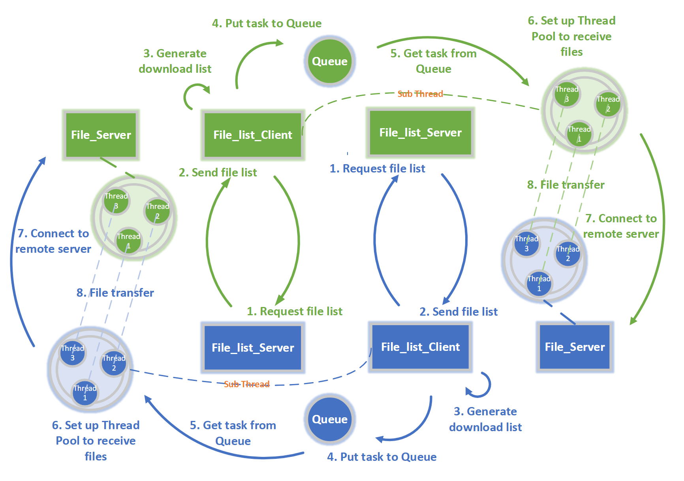

# CAN201 - Networking Project

## Specification

File sharing is a commonly used network-based application in our daily life. There are a lot of excellent apps that provided such services, such as Dropbox, Google Drive, Baidu NetDisk, iCloud, and XJTLU BOX.

This project aims at using Python Socket network programming to design and implement a **Large Efficient Flexible and Trusty (LEFT) Files Sharing program**. From the name of this coursework, you may “get” the requirements of this coursework:

**Large:**

- Format: files with any format and folders (excluding hidden files and folders)
- Size: single file is up to 500MB

**Efficient:**

- Fast: the faster, the better
-  Automatic: the new files/folders and changed files/folders can be synchronized automatically

**Flexible:**

- The IP addresses of peers should be set as an argument (only two peers)
- Resume from interruption

**Trusty:**

- No Error for any files

## Requirements

- \>= Python 3.6
- tqdm

## Structure

